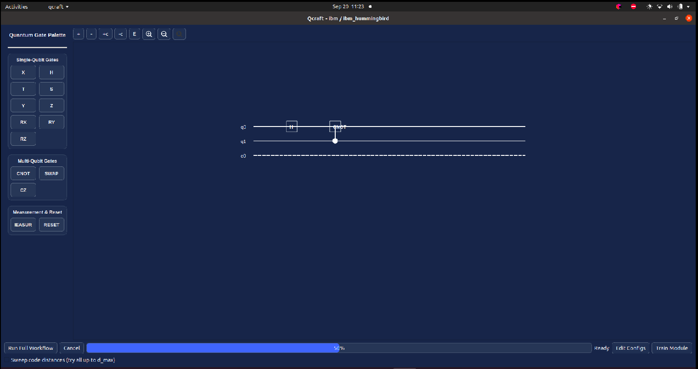
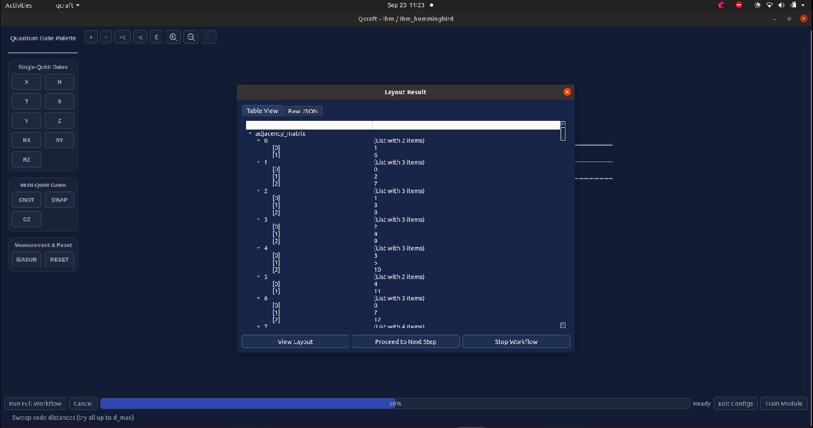
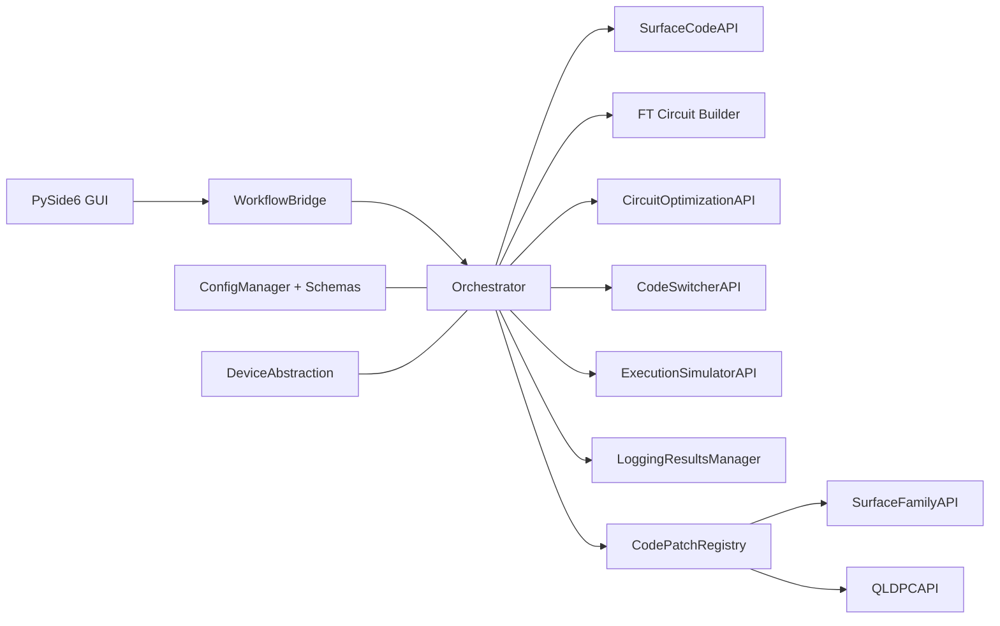
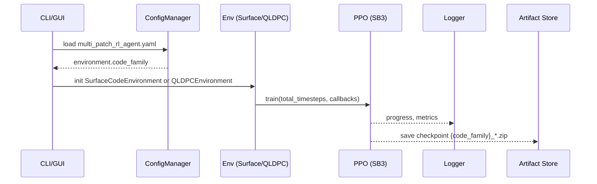
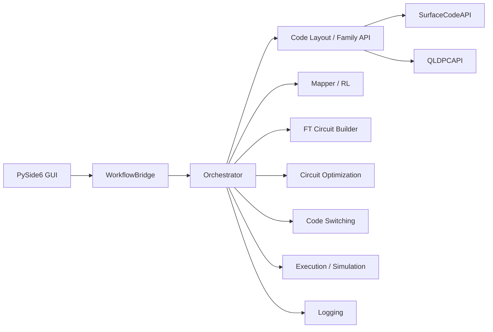
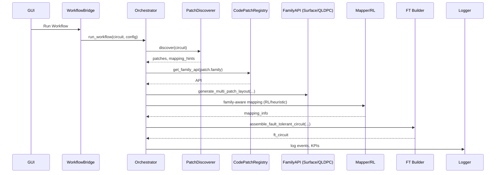

<!-- SPDX-License-Identifier: PolyForm-Noncommercial-1.0.0 | SPDX-FileCopyrightText: 2025 Dr. Debasis Mondal <deba10106@gmail.com> -->

# Qcraft: Code Patch Optimizer (Surface + qLDPC) Using Reinforcement Learning

## Screenshots

> If the images do not render, place them under `assets/screenshots/` with the filenames below.

- Quantum Circuit Designer (Classic)
  
  

- Layout Preview
  
  

## Introduction

Qcraft is a privacy-first desktop application and compiler that helps you design, map, and optimize fault-tolerant quantum circuits on your local machine.

What the desktop app is for:
- Design or import logical quantum circuits and visualize them in the GUI.
- Generate hardware-aware code layouts (Surface, qLDPC) for chosen devices.
- Assemble fault-tolerant (FT) circuits from layouts and mapping info.
- Optimize circuits using RL/ML or rule-based strategies with graceful fallback when RL is unavailable.
- Map logical to physical qubits and simulate/execute to validate results.

How it works (high level):
- You configure provider/device and code family in YAML.
- The workflow runs steps: layout → FT circuit → code switching → optimization → mapping → execution/simulation.
- Results at each step are inspectable in dialogs, including layouts, mappings, and FT circuits.
- Errors are surfaced and the UI offers safe fallbacks and branching choices.

Everything is configuration-driven (YAML) and family-aware (Surface and qLDPC). Curriculum learning, multi-patch mapping, and hardware-aware optimizations are supported end-to-end.

## Methodology

The framework is composed of the following modular components:

- **HeuristicInitializationLayer**: Generates valid surface code layouts (planar, toric, rotated, color) for arbitrary code distances and grid connectivities, ensuring only valid codes are used for training.
- **ConnectivityAwareGraphTransformer**: Maps ideal surface code layouts to hardware-aware graphs, respecting native coupling maps and minimizing non-native operations.
- **ReinforcementLearningAgent**: Refines hardware-mapped layouts using curriculum learning and dynamic reward shaping. Supports continuous learning, checkpointing, and config-driven policy networks.
- **MultiObjectiveRewardEngine**: Computes reward using a multi-objective formula, with all weights and normalization strategies specified in YAML config files.
- **MultiPatchMapper**: Maps multiple logical qubits (surface code patches) onto a single hardware device, supporting adjacent, separated, and shared-boundary layouts, as well as constraints like minimum distance and patch shapes.
- **EvaluationFramework**: Systematically assesses logical error rate, resource efficiency, learning efficiency, and hardware adaptability.

## What's New (2025-Q3)

- Family-aware training: choose code family via `configs/multi_patch_rl_agent.yaml -> multi_patch_rl_agent.environment.code_family` (`surface` or `qldpc`).
- qLDPC support: added `qldpc/` family with `QLDPCAPI`, generator/mapper, and a minimal `QLDPCEnvironment` for RL.
- Family registry and schema: `configs/code_families.yaml` validated by `schemas/code_families.schema.yaml` to dynamically load families.
- Schema coverage expanded: `qldpc_config.schema.yaml`, `analysis.schema.yaml`, `profiler.schema.yaml`, updated `workflow_policy.schema.yaml`.
- FT builder per-code-space transversality and code switching policy integrated.
- GUI: Train Module dropdown renamed to "Code Patch Optimizer" (Surface vs qLDPC is picked by config).

All parameters, including RL agent settings, curriculum phases, reward weights, and hardware profiles, are specified in YAML/JSON config files. No hardcoded values are present in the codebase.

## Run Locally (Virtual Environment)

Use a Python virtual environment to run the GUI locally:

```bash
# From the repo root
python3 -m venv .venv
source .venv/bin/activate
python -m pip install --upgrade pip setuptools wheel
pip install -r requirements.txt

# Launch the GUI
python -c "from circuit_designer.gui_main import main; main()"
```

## License

- This repository is licensed under the PolyForm Noncommercial License 1.0.0.
- Copyright (c) 2025 Dr. Debasis Mondal <deba10106@gmail.com>
- Commercial use is prohibited. Education and research use is allowed under the license.
- Full license text: https://polyformproject.org/licenses/noncommercial/1.0.0/

SPDX headers can be applied to all source files using the helper script:

```bash
# Dry run: show files that would be updated
python3 scripts/apply_spdx_headers.py --dry-run

# Apply headers in-place
python3 scripts/apply_spdx_headers.py --apply
```

Each file will receive lines like the following at the top (comment style adjusted per language):

```
SPDX-License-Identifier: PolyForm-Noncommercial-1.0.0
SPDX-FileCopyrightText: 2025 Dr. Debasis Mondal <deba10106@gmail.com>
```

- If you run into Qt display issues on Linux, ensure you are in a desktop session and try setting `QT_QPA_PLATFORM=xcb` or `QT_QPA_PLATFORM=wayland`.
- Entry point lives in `circuit_designer/gui_main.py` (`main()` function). The main window wires the workflow and opens the Training dialog via `TrainingDialog`.

## Train on GCP from the Local App (Cloud GPUs via Vertex AI)

The app can run locally while offloading RL training to Google Cloud Vertex AI (managed GPUs). The GUI will stream logs, allow cancel, and download artifacts from GCS when finished.

### Prerequisites

- GCP project with the following APIs enabled: Vertex AI, Cloud Storage, Cloud Logging.
- A GCS bucket for artifacts, e.g., `gs://YOUR_BUCKET`.
- A training container image pushed to Artifact Registry with `cloud/training_entrypoint.py` included (see `docker/Dockerfile.gpu`). Example:

```bash
# Example variables
PROJECT_ID=your-project
REGION=us-central1
REPO=qcraft
IMAGE=qcraft-gpu:latest

gcloud auth configure-docker ${REGION}-docker.pkg.dev
docker build -f docker/Dockerfile.gpu -t ${REGION}-docker.pkg.dev/${PROJECT_ID}/${REPO}/${IMAGE} .
docker push ${REGION}-docker.pkg.dev/${PROJECT_ID}/${REPO}/${IMAGE}
```

#### Build and Push via helper script (recommended)

Use the helper script `docker/docker_build_push_to_gcp_script.sh` which validates paths, supports build-only mode, and config overrides.

- Build only (skip push):

```bash
SKIP_PUSH=1 bash docker/docker_build_push_to_gcp_script.sh
```

- Build and push (requires Google Cloud SDK):

```bash
gcloud auth login
gcloud auth application-default login
gcloud config set project YOUR_PROJECT

bash docker/docker_build_push_to_gcp_script.sh
```

- Override defaults (project/region/repo/image):

```bash
PROJECT_ID=your-project REGION=us-central1 REPO=qcraft IMAGE=qcraft-gpu:latest \
  bash docker/docker_build_push_to_gcp_script.sh
```

Notes:
- The script uses an absolute Dockerfile path `docker/Dockerfile.gpu` and the repo root as build context.
- It warns if `requirements.txt` is missing at the repo root (the Dockerfile expects it).
- If you don’t have `gcloud` installed or authenticated, set `SKIP_PUSH=1` to build locally without pushing.

### Credentials

The app uses Google Application Default Credentials (ADC):

- Recommended (interactive):
  ```bash
  gcloud auth application-default login
  ```

- Or store a service-account JSON securely so the app can auto-configure ADC at runtime:
  ```python
  from utils.credential_manager import store_gcp_service_account_json
  store_gcp_service_account_json(open("/path/to/sa.json").read())
  At run time, the GUI attempts ADC; if missing, it calls `utils.credential_manager.ensure_google_adc_from_stored()` to set `GOOGLE_APPLICATION_CREDENTIALS` automatically.

### Using the GUI for Cloud or Local GPU Training

1. Open the app and click "Train Module" to open `TrainingDialog`.
2. Open the "GPU Selection" tab and choose a backend from the dropdown:
   - Local GPU (default): trains on your local machine; no cloud fields are shown.
   - Google Cloud (Vertex AI): shows GCP fields.
   - AWS (SageMaker): shows AWS fields.
3. If using Google Cloud (Vertex AI), fill in:
     - Project ID, Region (e.g., `us-central1`)
     - GCS Bucket (e.g., `gs://YOUR_BUCKET`)
     - Image URI (e.g., `us-central1-docker.pkg.dev/PROJECT/REPO/qcraft-gpu:latest`)
     - Machine type (e.g., `n1-standard-8`) and optional GPU type/count (e.g., `NVIDIA_TESLA_T4`, 1)
     - Optional: Dataset GCS URI
     - Timeout (min) and "Auto-cancel at timeout" if desired
   If using AWS (SageMaker), fill in:
      - Region (e.g., `us-east-1`)
      - Role ARN (e.g., `arn:aws:iam::<account>:role/SageMakerExecutionRole`)
      - S3 Bucket (e.g., `s3://YOUR_BUCKET` or `YOUR_BUCKET`)
      - Image URI (e.g., `<account>.dkr.ecr.<region>.amazonaws.com/qcraft-gpu:latest`)
      - Instance type (e.g., `ml.g5.xlarge`)
      - Optional: Dataset S3 URI, Job Name, Timeout (min)
4. Click "Start Training".
   - The GUI polls Vertex AI status, streams logs via Cloud Logging, and shows progress.
   - Click "Stop Training" to cancel the Vertex AI job.
5. When the job reaches a terminal state, click "Download Artifacts" to fetch the results from GCS to a local folder.

Note: AWS (SageMaker) support is experimental and may require additional setup.
Notes:
- Artifacts are written under your bucket (e.g., `gs://YOUR_BUCKET/artifacts/<job_name>/`). The GUI will offer to download them locally when available.
- Logs are fetched via Cloud Logging filters keyed to the Vertex AI CustomJob ID. If logs appear sparse, wait a few seconds or reduce the GUI poll interval.
- Credential checks and fallback live in `circuit_designer/training_dialog.py::_ensure_gcp_credentials()` and `utils/credential_manager.py`.
 - For AWS, SageMaker artifacts are downloaded from the configured S3 output path (uses `cloud/sagemaker_trainer.py`). Ensure your environment has AWS credentials and IAM permissions for SageMaker and S3.


## Updates (Oct 1, 2025)

- Packaging now relies on `MANIFEST.in` for resources. Optional extras added in `setup.py`:
  - `qiskit`: IBM/Aer backends
  - `security`: `cryptography`, `keyring`
  - `full`: all optional deps (`qiskit` + `security`)
- Single-patch mapping restored: `scode/heuristic_layer/surface_code.py::get_single_patch_mapping()` wraps `get_multi_patch_mapping()` with one logical patch.
- Logging cleanup: replaced `print()` with `logging` in `circuit_designer/visualization/mapping_visualizer.py` and `execution_simulation/execution_simulator.py`.
- Credentials: `execution_simulation/execution_simulator.py` now uses `utils/credential_manager.CredentialManager` (falls back to `.env` via `ConfigManager`).
- MANIFEST includes `privacy/`, `utils/`, `schemas/*.yaml|*.json`, and `assets/`.

## Updates (Oct 2, 2025)

- Security: `privacy/circuit_encryptor.py` now uses AES-256-GCM when a password is provided, with per-export random salt (16B) and nonce (12B). A header `QCGCM1` prefixes the payload. Key derivation uses PBKDF2-HMAC-SHA256 (200k iterations). If no password is provided, Fernet remains as a fallback.
- Public API: `scode/api.py::SurfaceCodeAPI.get_single_patch_mapping()` exposes a stable single-patch mapping entrypoint that forwards to the unified mapper.
- Optional deps guardrails: visualization requires `matplotlib`; RL training requires `stable-baselines3`. Clear import-time errors guide installation via extras, e.g. `pip install '.[full]'`.
- Deprecations: legacy module entrypoints under `scode/*/__main__.py` are deprecated in favor of the API and GUI.
- Logging: additional print-to-logging cleanup across mapping and RL paths.

## Current Architecture (Mermaid)



## Training Flow (Family-Aware)

```mermaid
flowchart LR
  CFG[configs/multi_patch_rl_agent.yaml] --> CF{{code_family}}
  CF -->|surface| SEnv[SurfaceCodeEnvironment]
  CF -->|qldpc| QEnv[QLDPCEnvironment]
  HW[hardware.json -> DeviceAbstraction] --> SEnv
  HW --> QEnv
  SEnv --> PPO[PPO (SB3)]
  QEnv --> PPO
  PPO --> ART[training_artifacts/{code_family}_*.zip]
```

## Sequence Diagram: Family-Aware Training & Artifacts



## Current Workflow (Mermaid)



## Sequence Diagram: Family Selection & Mapping



## Selecting Code Family (Surface vs qLDPC)

Set the family in `configs/multi_patch_rl_agent.yaml`:

```yaml
multi_patch_rl_agent:
  environment:
    code_family: surface  # or qldpc
    layout_type: rotated  # for surface; use tanner for qldpc
    code_distance: 3
```

- The GUI Train Module is generically named "Code Patch Optimizer"; the actual family is chosen by this config.
- Artifacts are saved with `{code_family}` in the filename for clarity.

## Reward

The reward function is fully modular, config-driven, and supports both normalization and curriculum phase shaping. The general formula is:

```
reward = -(
    α * weighted_gate_error +
    β * total_swap_gates +
    γ * circuit_depth +
    δ * logical_error_rate +
    ε * weighted_qubit_error -
    ζ * stabilizer_score
)
```

- **Normalization:** If enabled in the config and provided with baseline metrics, each component can be normalized (e.g., using running mean/std).
- **Curriculum phase shaping:** During training, reward components are dynamically scaled depending on the current curriculum phase:
  - *Structure Mastery*: stabilizer_score is boosted
  - *Hardware Adaptation*: swaps and gate errors are penalized more
  - *Noise-Aware Optimization*: logical error rate is penalized more
- **Tunable weights:** All weights (α, β, γ, δ, ε, ζ) are provided via config and can be updated dynamically.

All weights and normalization strategies are specified in the config. Reward shaping and phase progression are handled automatically by the RL agent according to curriculum criteria.

## Multi-Patch RL Agent Reward Function

The multi-patch RL agent uses a modular, fully config-driven reward function designed for robust, scalable mapping of multiple logical surface code patches onto hardware. The reward function is defined in `configs/multi_patch_rl_agent.yaml` and implemented in `scode/rl_agent/MultiPatchRewardEngine`. It is designed to:
- Encourage valid, non-overlapping mappings for all patches
- Optimize hardware connectivity and adjacency for each patch
- Minimize inter-patch crosstalk and maximize parallelism
- Promote efficient resource utilization
- Support curriculum learning and continuous learning

**Reward formula:**

```
reward = (
    valid_mapping * I[all patches mapped and valid]
    + invalid_mapping * I[invalid or overlapping mapping]
    + overlap_penalty * (number of overlapping qubits)
    + connectivity_bonus * (hardware connectivity score)
    + adjacency_bonus * (logical adjacency score)
    + inter_patch_distance_penalty * (mean inter-patch distance)
    + resource_utilization_bonus * (fraction of hardware qubits used)
    + error_rate_bonus * (1 - avg_error_rate)
    + logical_operator_bonus * (logical operator mapping score)
    + fully_mapped_bonus * I[all logical qubits mapped]
    + mapped_qubit_bonus * (number of mapped qubits)
    + unmapped_qubit_penalty * (number of unmapped qubits)
    + connected_bonus * (connectivity component bonus)
    + disconnected_graph_penalty * (penalty for disconnected mapping)
    + sum(custom_term[i] * value[i] for i in custom_terms)
)
```

**Where:**
- `valid_mapping` and `invalid_mapping` are large positive/negative rewards for achieving or failing a valid mapping.
- `overlap_penalty` penalizes any overlap of hardware qubits between patches.
- `connectivity_bonus` rewards mappings that preserve hardware connectivity for each patch.
- `adjacency_bonus` rewards mappings that preserve logical adjacency (important for code switching and logical operations).
- `inter_patch_distance_penalty` penalizes mappings where patches are too close (crosstalk risk) or too far (resource waste).
- `resource_utilization_bonus` rewards efficient use of available hardware qubits.
- `custom_terms` allow for extensibility (e.g., penalizing specific hardware constraints or rewarding special topologies).

**Rationale:**
- This reward function is designed to be robust for multi-logical-qubit (multi-patch) mapping, where the agent must balance intra-patch code quality, inter-patch separation, and hardware constraints.
- All weights and terms are settable in the config, allowing for easy tuning and curriculum learning (e.g., start with single patch, increase patch count, adjust penalties/bonuses as agent progresses).
- The function is modular and extensible, supporting new reward terms as research evolves.
- By combining validity, overlap, connectivity, adjacency, and resource terms, the agent learns to produce mappings that are both hardware-feasible and optimal for FT circuit construction.

See `multi_patch_rl_agent.yaml` and `schemas/multi_patch_rl_agent.schema.yaml` for all configurable parameters and their documentation.

## Multi-Patch RL Agent Reward Function (Advanced)

The multi-patch RL agent now uses a highly granular, curriculum-aware, and normalization-enabled reward function. All terms are config-driven and support curriculum phase shaping and normalization:

```
reward = (
    valid_mapping * I[all patches mapped and valid]
    + invalid_mapping * I[invalid or overlapping mapping]
    + overlap_penalty * (number of overlapping qubits)
    + connectivity_bonus * (hardware connectivity score)
    + adjacency_bonus * (logical adjacency score)
    + inter_patch_distance_penalty * (mean inter-patch distance)
    + resource_utilization_bonus * (fraction of hardware qubits used)
    + error_rate_bonus * (1 - avg_error_rate)
    + logical_operator_bonus * (logical operator mapping score)
    + fully_mapped_bonus * I[all logical qubits mapped]
    + mapped_qubit_bonus * (number of mapped qubits)
    + unmapped_qubit_penalty * (number of unmapped qubits)
    + connected_bonus * (connectivity component bonus)
    + disconnected_graph_penalty * (penalty for disconnected mapping)
    + sum(custom_term[i] * value[i] for i in custom_terms)
)
```

- **Normalization:**
  - `normalization`: One of `none`, `running_mean_std`, `clip`, `percentile` (see config example).
- **Curriculum-based reward shaping:**
  - `dynamic_weights`: If true, reward weights are dynamically scaled per curriculum phase.
  - `phase_multipliers` and `reward_weights` in each curriculum stage allow fine-tuned shaping.

#### Example Config (multi_patch_rl_agent.yaml)

```yaml
reward_function:
  valid_mapping: 10.0
  invalid_mapping: -20.0
  overlap_penalty: -5.0
  connectivity_bonus: 2.0
  adjacency_bonus: 1.0
  inter_patch_distance_penalty: -1.0
  resource_utilization_bonus: 0.5
  error_rate_bonus: 1.0
  logical_operator_bonus: 1.0
  fully_mapped_bonus: 2.0
  mapped_qubit_bonus: 0.1
  unmapped_qubit_penalty: -0.05
  connected_bonus: 1.0
  disconnected_graph_penalty: -0.1
  normalization: running_mean_std
  dynamic_weights: true
  phase_multipliers:
    hardware_adaptation_gate_error: 2.0
    hardware_adaptation_swap: 2.0
    noise_aware_logical_error: 2.5
    structure_mastery_stabilizer: 3.0
  custom_terms: []
curriculum_learning:
  enabled: true
  stages:
    - patch_count: 1
      max_steps: 200
      total_timesteps: 100000
      reward_weights:
        connectivity_bonus: 0.2
        adjacency_bonus: 0.2
        error_rate_bonus: 0.0
        logical_operator_bonus: 2.0
        fully_mapped_bonus: 2.0
    - patch_count: 2
      max_steps: 300
      total_timesteps: 200000
      reward_weights:
        connectivity_bonus: 0.5
        adjacency_bonus: 0.5
        error_rate_bonus: 1.0
        logical_operator_bonus: 0.5
        fully_mapped_bonus: 0.5
    - patch_count: 3
      max_steps: 400
      total_timesteps: 300000
      reward_weights:
        connectivity_bonus: 1.0
        adjacency_bonus: 1.0
        error_rate_bonus: 2.0
        logical_operator_bonus: 1.0
        fully_mapped_bonus: 0.5
  schedule: linear
```

### Evaluation & KPIs

The evaluation framework supports comprehensive validation and benchmarking:
- **Logical Error Rate (LER):** Uses Stim + Pymatching via DecoderInterface.
- **Resource Efficiency:** Physical qubits, circuit depth, SWAP overhead, weighted gate errors.
- **Learning Efficiency:** Training time, episodes to convergence.
- **Hardware Adaptability:** Performance across hardware profiles.
- **Comprehensive Validation:** Checks structure, hardware compatibility, logical operator mapping, and LER.
- **Scenario Evaluation:** Run evaluation scenarios and compare against baselines.

#### Running Evaluation

To run a comprehensive evaluation, use:

```
python -m evaluation
```

This will load real configs and layouts, run all KPIs, and print/save results. See `evaluation/evaluation_framework.py` for details.

## Configuration Parameters Explained

### RL Agent (`rl_agent`)

- `algorithm`: RL algorithm to use (e.g., PPO, DQN).
- `learning_rate`: Learning rate for the optimizer.
- `gamma`: Discount factor for future rewards.
- `batch_size`: Number of samples per training batch.
- `num_episodes`: Total number of training episodes.
- `max_steps_per_episode`: Maximum steps per episode.
- `ler_frequency`: How often (in episodes) to compute logical error rate (LER).
- `ler_num_trials`: Number of Monte Carlo trials per LER estimate.
- `ler_noise_prob`: Noise probability for LER estimation.
- `ppo_epochs`: Number of PPO update epochs per batch.
- `ppo_clip_eps`: PPO clipping epsilon for policy updates.
- `invalid_action_penalty`: Penalty value for invalid actions in action masking.
- `policy_network`/`value_network`: Structure and activation of policy/value networks.
- `optimizer`: Optimizer type (Adam, SGD, etc.).
- `device`: Device for training (auto, cpu, cuda).
- `checkpoint_interval`: Save policy every N episodes.
- `n_envs`: Number of parallel environments for data collection.

### Reward Engine (`reward_engine`)

- `normalization`: Reward normalization strategy (e.g., running_mean_std).
- `low_latency`: Optimize for low-latency reward computation.
- `dynamic_weights`: Allow dynamic reward weights.
- `phase_multipliers`: Multipliers for reward components in different curriculum phases:
  - `structure_mastery_stabilizer`: Multiplier for stabilizer score in Structure Mastery phase.
  - `hardware_adaptation_swap`: Multiplier for swap penalty in Hardware Adaptation phase.
  - `hardware_adaptation_gate_error`: Multiplier for gate error penalty in Hardware Adaptation phase.
  - `noise_aware_logical_error`: Multiplier for logical error rate in Noise-Aware Optimization phase.

### Curriculum (`curriculum`)

- `enabled`: Whether curriculum learning is enabled.
- `phases`: List of curriculum phases, each with:
  - `name`: Phase name.
  - `reward_weights`: Dict of weights (see below).
  - `criteria`: Dict of criteria for phase progression (e.g., valid_layouts, stabilizer_score, reward_variance, mean_swap, gate_errors, hardware_compatibility, logical_error_rate_improvement, reward_convergence, validation_performance).

#### Reward Weights (`reward_weights`)

- `alpha`: Weight for weighted gate error (sum of error rates for all gates used in the code).
- `beta`: Weight for total swap gates (SWAP overhead).
- `gamma`: Weight for circuit depth (latency/resource usage).
- `delta`: Weight for logical error rate (LER, code performance).
- `epsilon`: Weight for weighted qubit error (sum of error rates for all qubits used in the code, data + ancilla).
- `zeta`: Weight for stabilizer score (code quality/validity).

**Implications and Impact:**

- Increasing `alpha`, `beta`, `gamma`, `delta`, or `epsilon` penalizes the corresponding metric, making the RL agent avoid high error, swaps, depth, LER, or qubit count.
- Increasing `zeta` rewards higher stabilizer score, encouraging valid and robust code layouts.
- Adjusting these weights in curriculum phases allows staged learning: e.g., first focus on code validity, then hardware adaptation, then noise resilience.

### Evaluation (`evaluation`)

- `default_logical_error_rate`: Default LER if not computed.
- `default_training_time`: Default training time if not measured.
- `reward_variance_threshold`: Threshold for reward variance to determine convergence.

### Actions (`actions`)

- `enabled_types`: List of allowed action types (swap, rewire, assign_gate).
- `max_swaps_per_episode`: Maximum number of swaps allowed per episode.

### Multi-Patch (`multi_patch`)

- `num_patches`: Number of surface code patches to map.
- `patch_shapes`: Shape of each patch.
- `min_distance_between_patches`: Minimum distance between patches.
- `layout_type`: Patch layout type (adjacent, custom).

### System (`system`)

- `random_seed`: Random seed for reproducibility.
- `log_level`: Logging level.
- `output_dir`: Directory for outputs, logs, checkpoints.
- `device_preference`: Device for training (auto, cpu, cuda).

### Surface Code (`surface_code`)

- `code_distance`: Code distance for surface code.
- `layout_type`: Code layout (planar, rotated, toric, color).
- `visualize`: Whether to visualize the generated code.

## Classical Register Support

- You can add or remove classical bits (registers) using the [+c] and [-c] buttons in the circuit designer UI.

```yaml
multi_patch:
  num_patches: 2
  patch_shapes:
    - rectangular
    - rectangular
  min_distance_between_patches: 1
  layout_type: adjacent
```

### Usage

- The workflow will generate and map multiple surface code patches according to the above configuration.
- The mapping result will include:
  - `multi_patch_layout`: Patch layouts for each patch
  - `resource_allocation`: Mapping of logical qubits to patches
  - `inter_patch_connectivity`: Connectivity between patches
  - `optimization_metrics`: Metrics for the mapping (e.g., swaps, error rates)

### Fault-Tolerant Circuit Assembly

- The system will assemble a complete fault-tolerant circuit using the multi-patch mapping.
- Each gate in the circuit will be annotated with its patch assignment.
- The final circuit is validated for the target device and can be exported in standard formats (QASM, JSON, YAML).

### Visualization

- The GUI and CLI tools will display all patch layouts and mapping overlays.
- You can view the mapping of each logical patch onto the hardware grid, including inter-patch connectivity.

## Opportunities for Improvement (Clarified & Expanded)

- **Advanced RL Algorithms:** Currently, PPO (Proximal Policy Optimization) is implemented as the main RL algorithm. Future work could add DQN, A3C, distributed actor-critic, or meta-RL approaches for broader benchmarking and performance.
- **LER Estimation & Noise Models:** The framework already uses Stim and PyMatching for accurate, research-grade logical error rate estimation. Further improvements could include more realistic noise models (e.g., correlated, biased, or hardware-calibrated noise), adaptive LER estimation, or integration with additional simulators (Qiskit, Cirq) for non-Clifford circuits.
- **Curriculum Learning:** Explore more advanced curriculum strategies, such as automatic phase progression, adaptive reward shaping, or meta-curriculum learning.
- **Visualization:** Add advanced visualization tools for code layouts, training progress, evaluation metrics, and hardware mapping.
- **User Interface:** Develop a web-based or CLI dashboard for experiment management, hyperparameter tuning, and result analysis.
- **Plugin System:** Expand the plugin architecture for easy addition of new hardware backends, reward functions, RL agents, and curriculum strategies.
- **Community Contributions:** Encourage open-source contributions, benchmarking, collaborative research, and shared datasets.
- **Automated Hyperparameter Tuning:** Integrate tools for automated hyperparameter search (e.g., Optuna, Ray Tune).
- **Benchmarking Suite:** Develop a benchmarking suite for comparing different code layouts, hardware profiles, and RL strategies.
- **Hardware-in-the-Loop:** Support for running experiments on real quantum hardware or high-fidelity simulators.
- **Documentation & Tutorials:** Expand documentation, add example configs, and provide step-by-step tutorials for new users.
- **Logging & Monitoring:** Improve logging, monitoring, and experiment tracking (e.g., with MLflow, Weights & Biases).
- **Robust Error Handling:** Add more robust error handling and diagnostics for all pipeline stages.
- **Test Coverage:** Increase unit and integration test coverage, including edge cases and hardware-specific scenarios.

## Installation (Ubuntu 20.04+)

The steps below are tested on Ubuntu 20.04 LTS. They include the exact system and Python steps we used to run the GUI successfully.

### 1) Install system libraries for Qt/X11

These packages are required to run the PySide6 GUI in normal (non-headless) mode:

```bash
sudo apt-get update && sudo apt-get install -y \
  libxkbcommon-x11-0 libxcb-cursor0 libxcb-xinerama0 \
  libxcb-icccm4 libxcb-image0 libxcb-keysyms1 libxcb-render-util0 \
  libegl1 libgl1-mesa-glx
```

If you see warnings about a GPG key for unrelated repos (e.g., Google Chrome), you can ignore them—they do not affect these packages.

### 2) Create and activate a virtual environment

From the project root directory:

```bash
python3 -m venv .venv
source .venv/bin/activate
python -m pip install --upgrade pip setuptools wheel
```

### 3) Install Qcraft in editable mode (base install)

We moved heavy, optional Qiskit dependencies into `extras_require` so the base install doesn’t attempt to build `qiskit-aer`.

```bash
pip install -e .
```

### 4) Launch the GUI

```bash
qcraft
```

If you are in the project root and prefer explicit path:

```bash
.venv/bin/qcraft
```

Notes:
- If you’re on an SSH session without X forwarding (no display), the GUI cannot open. Use a local desktop session or X forwarding.
- In the console you may see: `No module named 'qiskit_aer'`. This is harmless unless you try to use Aer/IBM execution backends.

### 5) Optional: enable Qiskit execution backends

If you want IBM Runtime or local Aer simulators:

```bash
pip install '.[qiskit]'
```

`qiskit-aer` may require BLAS/LAPACK/OpenMP toolchains. If building fails, you can continue without it—the GUI and non-Aer features work fine.

### 6) Configure hardware and devices

Select a provider and device in `configs/hardware.json`. Provider must match a devices YAML (e.g., `ibm` => `configs/ibm_devices.yaml`).

### Troubleshooting

- Qt “xcb” plugin error:
  - Error: `Could not load the Qt platform plugin "xcb"`.
  - Fix: Install the packages listed in step 1, then relaunch `qcraft`.

- ImportError: `importlib.resources.files` on Python 3.8:
  - The code includes fallbacks for Python 3.8. If you still see this, ensure you’re running the app from the repo root (so configs/assets are discoverable), or update Python to 3.9+.

- Aer import warning:
  - `No module named 'qiskit_aer'` appears if you didn’t install the Qiskit extras. Safe to ignore unless you need Aer/IBM backends.

## Quickstart

1. Edit `configs/multi_patch_rl_agent.yaml` to set training parameters and choose the code family via `multi_patch_rl_agent.environment.code_family` (surface or qldpc).
2. Edit `configs/hardware.json` to select your provider and device. The provider should match the prefix of a devices YAML file (e.g., `ibm` for `ibm_devices.yaml`).
3. (Optional) Edit or select a hardware/device YAML file in `configs/`.
4. Edit `configs/gates.yaml` to define the set of gates shown in the circuit designer (GUI palette). Backend enforcement of native gate sets uses provider/device configs (e.g., `configs/ibm_devices.yaml`, `configs/ionq_devices.yaml`) selected via `configs/hardware.json`. Optimizers will decompose any non-native gates to the device's `native_gates` from those files.
5. Run the RL agent training pipeline:
   
   - GUI: Launch `qcraft`, open the Training tab, and click "Start Training" under "Code Patch Optimizer".
   - API (example):
     ```python
     from scode.api import SurfaceCodeAPI
     api = SurfaceCodeAPI()
     api.train_surface_code_agent(provider='ibm', device='ibm_hummingbird', layout_type='rotated', code_distance=3)
     ```
6. (Optional) Monitor training progress with TensorBoard:
   
   ```bash
   tensorboard --logdir ./outputs/runs
   ```
7. Evaluate results:
   
   ```bash
   python3 -m evaluation.__main__
   ```

**Example minimal config:**

```
# Packaging and Distribution

## Packaging the Project

This project is structured for modular development and can be packaged as a Python package for distribution or installation. The backend and GUI are decoupled, and the RL agent, environment, and reward engine are all modular and compatible with the callback/logging mechanism for progress reporting.

### Key Features
- Modular backend with clear API boundaries
- PySide6 GUI with thread-safe progress/logging integration
- RL agent training supports log/progress callbacks for CLI, GUI, and test integration
- Flexible device/provider config handling
- Automatic checkpointing and policy saving

### Packaging Steps

1. **Ensure all dependencies are listed in `requirements.txt`**
2. **Add a `setup.py` and/or `pyproject.toml` for setuptools/PEP 517 packaging**
3. **Organize modules under a top-level package (e.g., `scode`, `circuit_designer`, etc.)**
4. **Include entry points for CLI and GUI (e.g., `gui_main.py`, `__main__.py`)**
5. **Add MANIFEST.in to include non-Python files (YAML configs, etc.)**
6. **Test install with `pip install .` and run both CLI and GUI**

---

## Building, Installing, and Running the Packaged App

To build and install the package and run the GUI from anywhere:

1. **Build the package (from the project root):**
   ```bash
   pip install wheel twine build &&

   python3 setup.py sdist bdist_wheel && pip install . && twine check dist/*
 && twine upload dist/*

```

2. **Install the package (replace version as needed):**
   
   ```bash
   pip install --force-reinstall dist/qcraft-0.1.0-py3-none-any.whl
   ```

3. **Run the GUI app (from any directory):**
   
   ```bash
   qcraft
   ```

This ensures all configuration files are found correctly, and the app can be launched from any location after installation.

---