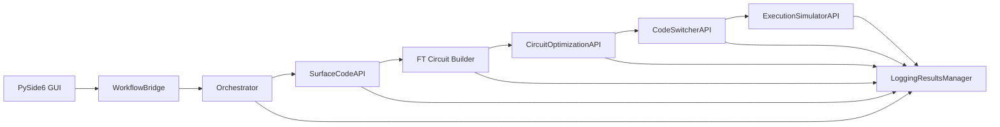

# Technical Specification Document (TSD)
## 2.1 Intended Architecture & Workflow (Target)

- Pluggable code families: `CodePatchRegistry` loads families from `configs/code_families.yaml` with per‑family APIs exposing discovery, generation, mapping, and supported gates.
- Family‑aware RL: a unified "Code Patch Optimizer" environment interface; per‑family envs (Surface, qLDPC) implement the same API to SB3.
- FT builder integration: per‑code‑space supported‑gate checks, automatic code switching (policy‑driven) when gates are non‑transversal.
- Orchestrator policy: selects code family and patch parameters based on device constraints and circuit metrics (via `PatchDiscoverer`).
## 3. Problems & Approach

- Diverse hardware and noise regimes mean Surface codes are not always best. We added a code‑family abstraction and registry so RL can target Surface or qLDPC and future families.
- Transversality is code‑dependent. The FT builder now checks gate support per code space and inserts code‑switching via policy when unsupported.
- Family selection should be config‑first. Training selects the environment (`SurfaceCodeEnvironment` vs `QLDPCEnvironment`) using `multi_patch_rl_agent.environment.code_family` in both GUI and CLI.
- Config correctness matters. We expanded schemas and added non‑fatal validation during module init to catch mistakes early without blocking runs.
## What's New (2025-Q3)

- Family‑aware training across Surface and qLDPC via `multi_patch_rl_agent.environment.code_family` (config‑first design).
- Minimal `scode/rl_agent/qldpc_environment.py` added; RL training selects environment by family in both GUI and CLI.
- FT builder now checks gate support per code space and inserts code switching decisions via policy when needed.
- New schemas (`qldpc_config`, `code_families`, `analysis`, `profiler`) and hardened `workflow_policy` schema; non‑fatal validation integrated.

Qcraft — Code Patch Optimizer (Surface + qLDPC), Mapper, and Workflow Orchestrator

Version: 0.1.x
Repository root: `/home/shoperbox/Downloads/qcraft/`
Primary entry-point (GUI): `circuit_designer/gui_main.py`

---

## 1. Introduction & Purpose

- **Product Vision**: Modular, configuration-driven platform to design, map, optimize, and optionally execute fault-tolerant (FT) quantum circuits using multiple code patch families (Surface and qLDPC) with RL.
- **Scope**: Code-family–aware generation/mapping (heuristic/RL), FT circuit assembly with per-code-space transversality, optimization, optional execution/simulation, results logging, schema‑validated configs.
- **Audience**: Quantum engineers/researchers; RL/ML researchers; product teams.
- **Necessity**: Bridges theory and device constraints; enables reproducibility via config+schemas; compares heuristics vs RL.

---

## 2. System Overview

- **Architecture**: PySide6 GUI → WorkflowBridge → Orchestrator → modules (SCODE, FT Builder, Optimizer, Code Switcher, Execution). Config/schemas via `ConfigManager`. Devices normalized by `DeviceAbstraction`.
- **Modules**:
  - GUI: `circuit_designer/`
  - Orchestrator: `orchestration_controller/orchestrator.py`
  - Surface Code API: `scode/api.py`
  - FT Builder: `fault_tolerant_circuit_builder/ft_circuit_builder.py`
  - Code Switcher: `code_switcher/code_switcher.py`
  - Optimizer: `circuit_optimization/`
  - Device Abstraction: `hardware_abstraction/device_abstraction.py`
  - Config+Schema: `configuration_management/`, `configs/`, `schemas/`
- **Tech**: Python 3.8+, PySide6, NetworkX, NumPy, Matplotlib, Stable‑Baselines3, Qiskit (I/O), jsonschema.

---

## 3. Functional Requirements

- **Features**: GUI editing; hardware selection; layout generation; mapping (heuristic/RL); FT assembly w/ code‑switching placeholders; optimization; logging; schema validation.
- **Flow**: GUI → Orchestrator steps: surface_code → mapper → ft_builder → optimizer → (code_switcher) → (executor).
- **Examples**:
  - Device info (`DeviceAbstraction.get_device_info`): normalized dict with `max_qubits`, `native_gates`, `qubit_connectivity`, `qubit_positions`.
  - Multi‑patch layout (`SurfaceCodeAPI.generate_multi_patch_surface_code_layout`): combined `qubit_layout`, `stabilizer_map`, `logical_operators`, `patch_info`, `code_spaces`.
  - RL mapping (`MultiPatchMapper.map_patches`): `logical_to_physical`, `multi_patch_layout`, metrics, `has_overlap`.
  - FT circuit (`FaultTolerantCircuitBuilder.assemble_fault_tolerant_circuit`): code‑space annotations + `code_switch_*` insertions.

---

## 4. Non‑Functional Requirements

- **Performance**: Heuristic mapping minutes; RL inference tens of minutes (policy dependent). Vectorized envs.
- **Security/Privacy**: No PII; API keys via `.env` (future keyring).
- **Scalability**: n‑envs for RL; artifact/log‑based experiments.
- **Compatibility**: Linux primary; Python 3.8+ with `importlib.resources` fallbacks; IBM/IONQ schemas.

---

## 5. Technical Specs

### 5.1 Config & Schemas
- Registry: `configs/config_registry.yaml`; loader/validator: `configuration_management/config_manager.py` + `schema_validator.py`.
- Schemas: `schemas/*.schema.yaml` for `hardware`, `ibm_devices`, `ionq_devices`, `circuit_editor`, `optimization`, `logging_results`, `workflow_policy` (permissive), `gates`, `ft_builder`.

### 5.2 Device Abstraction (`hardware_abstraction/device_abstraction.py`)
- Loads `hardware.json` (Python 3.8 fallbacks); provider YAMLs; normalizes keys/types; validates if schema available.
- APIs: `list_devices`, `get_device_info`, `get_native_gates`, `validate_circuit_for_device`.

### 5.3 Surface Code (`scode/api.py`, `heuristic_layer/surface_code.py`, `multi_patch_mapper/multi_patch_mapper.py`, `graph_transformer/graph_transformer.py`)
- Generate multi‑patch layouts; compute valid distances; create RL envs.
- Mapping via heuristics or RL policy; outputs `logical_to_physical` + metrics; checks overlaps.
- Graph transformer annotates hardware mapping and connectivity overheads (SWAP/depth/error estimates).

### 5.4 FT Circuit Builder (`fault_tolerant_circuit_builder/ft_circuit_builder.py`)
- Transforms logical gates into code‑space gates; inserts code‑switching markers; export/import JSON/YAML/QASM; defers native‑gate validation to later stages.

### 5.5 Code Switcher (`code_switcher/code_switcher.py`)
- Identifies unsupported gates; applies configured protocol sequences (magic‑state, lattice‑surgery, teleportation); extensible plugin registry.

### 5.6 Optimizer (`circuit_optimization/`)
- API + RL env/strategies; optimize circuits (depth/gates/swaps/scheduling); supports SB3 PPO, vectorization.

### 5.7 Orchestrator & Bridge
- Orchestrator runs module sequence with progress and logging (`orchestration_controller/orchestrator.py`).
- WorkflowBridge mediates GUI to modules, training flows, and logging (`circuit_designer/workflow_bridge.py`).

### 5.8 GUI/UX (`circuit_designer/`)
- Dark blue theme `#0F2747`, white text/lines/borders, blue progress `#2E86FF`.
- White‑stroke SVGs for zoom; canvas uses white wires and transparent white‑bordered gates.

---

## 6. Architecture Diagram (text)
- GUI → WorkflowBridge → Orchestrator → {SurfaceCodeAPI → (Heuristic Init, Graph Transformer, MultiPatchMapper), FT Builder, Optimizer, Code Switcher, Execution}
- ConfigManager loads `configs/*`, validates with `schemas/*`; DeviceAbstraction normalizes provider YAMLs and `hardware.json`.

---

## 7. Requirements
- **Minimum**: Ubuntu 20.04+, Python 3.8+, 8GB RAM.
- **Recommended (RL)**: CUDA GPU, 16GB+ RAM.
- **Deps**: PySide6, numpy, networkx, matplotlib, stable‑baselines3, jsonschema; optional qiskit.

---

## 8. Testing & Validation
- Unit: transformer/multi‑patch/reward env tests in `scode/tests/`.
- Integration: workflow orchestration with synthetic circuits/devices.
- KPIs: mapping time, resource utilization, LER estimate, depth/gate reductions.

---

## 9. Deployment & Maintenance
- Local editable install (`pip install -e .`); optional `.[qiskit]` extras.
- Versioning: 0.x rapid iteration; schemas evolve with modules.
- Maintainability: clear module boundaries, config‑first approach, centralized logging.

---

## 10. Future Extensions
- Native‑gate decomposition pass post‑FT builder.
- Execution backends (IBM Runtime/Aer) with robust job mgmt.
- Cluster training (Ray/SLURM) and artifact management.
- GNN‑based mapping; multi‑objective optimization.
- Rich UI visualizations and inspectors.

---

## 11. Repository Structure (code-derived)

- `circuit_designer/`
  - GUI entry and widgets: `gui_main.py`, `circuit_editor.py`, `circuit_canvas.py`, dialogs, `workflow_bridge.py`.
- `orchestration_controller/`
  - Orchestrator of the end-to-end workflow: `orchestrator.py`.
- `scode/`
  - Surface code API and subsystems: `api.py`, `heuristic_layer/`, `graph_transformer/`, `multi_patch_mapper/`, `rl_agent/`, `utils/`, `tests/`.
- `fault_tolerant_circuit_builder/`
  - FT assembly logic: `ft_circuit_builder.py`.
- `circuit_optimization/`
  - Optimizer API, RL env, strategies, utilities.
- `code_switcher/`
  - Code switching API and protocol implementations.
- `execution_simulation/`
  - Execution/Simulation API (local Aer, IBM Runtime placeholder): `execution_simulator.py`.
- `hardware_abstraction/`
  - Device provider YAML normalization and access: `device_abstraction.py`.
- `configuration_management/`
  - Config registry, loaders, schema validation: `config_manager.py`, `schema_validator.py`.
- `logging_results/`
  - Experiment logging, metrics, and results export: `logging_results_manager.py`.
- `configs/`
  - YAML/JSON config files (hardware, devices, RL, optimizer, etc.).
- `schemas/`
  - YAML schemas for config validation.
- `assets/`
  - UI assets (e.g., `zoom_reset.svg`).

---

## 12. Module APIs (key functions and behavior)

- Orchestrator (`orchestration_controller/orchestrator.py`)
  - `OrchestratorController.run_workflow(circuit: dict, user_config: dict|None, progress_callback) -> dict`
    - Executes a configurable module sequence (default: `surface_code → mapper → ft_builder → optimizer → code_switcher → executor`). Logs via `LoggingResultsManager`.
  - `optimize_circuit(circuit, device_info, config_overrides, progress_callback) -> dict`
  - `generate_surface_code_layout(layout_type: str, code_distance: int, device: str, config_overrides=None, progress_callback=None) -> dict`
  - `map_circuit_to_surface_code(circuit, device, layout_type, code_distance, provider=None, config_overrides=None, progress_callback=None, mapping_constraints=None) -> dict`
    - Uses `scode.heuristic_layer.SurfaceCode` to produce `multi_patch_mapping`, `logical_to_physical`, and debug stats.
  - `assemble_fault_tolerant_circuit(logical_circuit, mapping_info, code_spaces, device_info, ...) -> dict`
  - `decide_surface_code(device_info, circuit, user_prefs=None) -> {layout, distance}`
  - `coordinate_modules(modules: List[str], data: dict) -> dict`
  - `initialize_code(code_distance, layout_type, mapping_constraints) -> (codes, mapping)`

- Workflow Bridge (`circuit_designer/workflow_bridge.py`)
  - `QuantumWorkflowBridge.optimize_circuit(...)`
  - `map_circuit_to_surface_code(..., sweep_code_distance=False) -> {mapping_info|status}`
    - Ensures multi-logical-qubit circuits use the multi-patch RL agent; sets/repairs `mapping_constraints`.
  - `train_surface_code_agent(...) -> {policy_path, run_id}`; `get_surface_code_training_status(agent_path)`
  - `train_optimizer_agent(...) -> policy_path`; `get_optimizer_training_status(agent_path)`
  - Code switching wrappers: `identify_switching_points`, `select_switching_protocol`, `apply_code_switching`
  - Execution wrappers: `list_backends`, `run_circuit`, `get_job_status`, `get_job_result`
  - Config accessors via `ConfigManager`: `get_config`, `update_config`, `list_configs`, `get_schema`, `save_config`

- Surface Code API (`scode/api.py`)
  - `SurfaceCodeAPI.generate_multi_patch_surface_code_layout(num_patches=2, patch_distances=None, patch_shapes=None, visualize=False, device=None) -> dict`
    - Returns keys: `qubit_layout`, `stabilizer_map`, `logical_operators`, `adjacency_matrix (networkx.Graph)`, `patch_info`, `num_patches`, `code_distance`, `layout_type`, `grid_connectivity`, and `code_spaces`.
  - `get_multi_patch_mapping(code_distance: int, layout_type: str, mapping_constraints: dict, device: str|None = None, use_rl_agent: bool = True, rl_policy_path: str|None = None) -> dict`
    - Uses `MultiPatchMapper.map_patches(...)`; returns `multi_patch_layout`, `resource_allocation`, `optimization_metrics`, `logical_to_physical` where applicable.
  - `list_layout_types() -> List[str]`
  - `list_code_distances(device: str|None = None, layout_type: str|None = None) -> List[int]`
  - `calculate_max_code_distance(max_qubits: int, logical_qubits: int = 1, layout_type: str = 'rotated') -> int`
  - `list_supported_logical_gates(layout_type: str|None = None, code_distance: int|None = None, logical_operators: dict|None = None) -> List[str]`
  - Training: `train_surface_code_agent(provider, device, layout_type, code_distance, config_overrides=None, log_callback=None, run_id=None) -> {policy_path, run_id}`; `get_training_status(agent_path) -> dict`
  - Visualization and helpers: `visualize_surface_code(layout) -> bytes`, `validate_code_for_device(...) -> bool`.

- FT Circuit Builder (`fault_tolerant_circuit_builder/ft_circuit_builder.py`)
  - `FaultTolerantCircuitBuilder.assemble_fault_tolerant_circuit(logical_circuit, mapping_info, code_spaces, device_info) -> dict`
    - Transforms logical gates into code‑space gates; inserts code switching placeholders if needed; validates against device qubit limits.
  - `transform_logical_to_supported(...) -> (circuit, switching_points)`
  - `insert_code_switching(circuit, switching_points, code_spaces) -> dict`
  - `validate_fault_tolerant_circuit(circuit, device_info) -> bool`
  - Import/Export: `export_circuit(circuit, format, path)`, `import_circuit(path, format)`

- Code Switcher (`code_switcher/code_switcher.py`)
  - `CodeSwitcherAPI.identify_switching_points(circuit, code_info) -> List[dict]`
  - `select_switching_protocol(gate: str, available_protocols: List[str], config: dict|None) -> str|None`
  - `apply_code_switching(circuit, switching_points, protocols, device_info=None) -> dict`
  - Protocols: `magic_state_injection`, `lattice_surgery`, `teleportation` (extensible plugin registry).

- Device Abstraction (`hardware_abstraction/device_abstraction.py`)
  - `DeviceAbstraction.load_selected_device(hardware_json_path: str) -> dict`
  - `list_devices(provider: str) -> List[str]`, `get_device_info(provider: str, device_name: str) -> dict`
  - `validate_circuit_for_device(circuit, provider, device) -> bool`
  - Normalizes keys: `native_gates`, `connectivity`/`qubit_connectivity`, `qubit_positions` (int keys), `max_qubits`, `provider_name`.

- Optimizer (`circuit_optimization/api.py`)
  - `CircuitOptimizationAPI.optimize_circuit(circuit, device_info=None, config_overrides=None) -> dict`
  - `get_optimization_report(original_circuit, optimized_circuit) -> dict`
  - `validate_circuit(circuit, device_info=None) -> bool`
  - `export_circuit`, `import_circuit`, `get_supported_optimization_passes`, `get_circuit_summary`.

- Execution/Simulation (`execution_simulation/execution_simulator.py`)
  - `ExecutionSimulatorAPI.run_circuit(circuit, run_config=None) -> str`
  - `get_job_status(job_id) -> dict`, `get_job_result(job_id) -> dict`, `cancel_job(job_id)`
  - `get_supported_simulation_options(backend_name) -> dict`, `export_result(job_id, format, path)`
  - Qiskit dependencies are optional; Aer/IBM paths require extras (see Requirements).

---

## 13. Configuration Registry and Schemas

- Config registry (`configs/config_registry.yaml`)
  - `hardware`: `configs/hardware.json`
  - `ibm_devices`: `configs/ibm_devices.yaml`
  - `ionq_devices`: `configs/ionq_devices.yaml`
  - `circuit_editor`: `configs/editor_config.yaml`
  - `optimization`: `configs/optimizer_config.yaml`
  - `code_switcher`: `configs/switcher_config.yaml`
  - `logging_results`: `configs/logging.yaml`
  - `workflow_policy`: `configs/multi_patch_rl_agent.yaml`
  - `multi_patch_rl_agent`: `configs/multi_patch_rl_agent.yaml`
  - `gates`: `configs/gates.yaml`
  - `ft_builder`: `configs/ft_builder_config.yaml`

- Schemas (`schemas/*.schema.yaml`)
  - `circuit_editor.schema.yaml`
  - `code_switcher.schema.yaml`
  - `ft_builder.schema.yaml`
  - `gates.schema.yaml`
  - `hardware.schema.yaml`
  - `ibm_devices.schema.yaml`
  - `ionq_devices.schema.yaml`
  - `logging_results.schema.yaml`
  - `multi_patch_rl_agent.schema.yaml`
  - `optimization.schema.yaml`
  - `optimizer_config.schema.yaml`
  - `workflow_policy.schema.yaml`

Validation is performed via `configuration_management/schema_validator.py` through `ConfigManager.validate_config()`.

---

## 14. Logging and Results (APIs)

- `logging_results/logging_results_manager.py`
  - `LoggingResultsManager.log_event(event: str, details: dict = None, level: str = 'INFO')`
  - `log_metric(metric_name: str, value: float, step: int = None, run_id: str = None)`
  - `store_result(run_id: str, result: dict)` and `get_result(run_id: str)`
  - `list_runs() -> List[str]`, `get_run_summary(run_id) -> dict`
  - `export_log(run_id, format, path)` (json|yaml|csv)
  - Supports file/stdout logging, rotation, versioned results in `results/`.

---

## 15. Data Models (canonical structures)

- Device info (normalized) — `hardware_abstraction/DeviceAbstraction`
  - Keys: `provider_name`, `name`/`device_name`, `max_qubits`, `native_gates: List[str]`, `qubit_connectivity: Dict[int, List[int]]`, `qubit_positions: Dict[int, {x,y}]`, `gate_error_rates`, `qubit_properties` (readout errors), optional `grid_connectivity`/`topology_type`.

- Surface code layout — `scode/api.generate_multi_patch_surface_code_layout`
  - Keys: `qubit_layout`, `stabilizer_map`, `logical_operators`, `adjacency_matrix`, `patch_info`, `num_patches`, `code_distance`, `layout_type`, `grid_connectivity`, `code_spaces`.

- Multi‑patch mapping — `SurfaceCodeAPI.get_multi_patch_mapping`
  - Keys: `multi_patch_layout` (per‑patch `layout` and maps), `resource_allocation` ((patch_id, logical_qubit) → index), `optimization_metrics`, `logical_to_physical` (if present).

- FT circuit — `FaultTolerantCircuitBuilder.assemble_fault_tolerant_circuit`
  - Keys: `qubits: List[int]`, `gates: List[{name, qubits, params?, code_space?, patches?}]`, `code_spaces`.

---

## 16. Requirements and Setup (from README)

- System (Ubuntu 20.04+): install Qt/X11 libs for PySide6 GUI
  - `libxkbcommon-x11-0 libxcb-cursor0 libxcb-xinerama0 libxcb-icccm4 libxcb-image0 libxcb-keysyms1 libxcb-render-util0 libegl1 libgl1-mesa-glx`
- Python venv and editable install
  - `python3 -m venv .venv && source .venv/bin/activate && pip install --upgrade pip setuptools wheel`
  - `pip install -e .`
- Launch GUI: `qcraft` (entry point) or `.venv/bin/qcraft`
- Optional Qiskit execution backends
  - `pip install '.[qiskit]'` for IBM Runtime/Aer support (see `requirements.txt` for base deps)
- Configure hardware: edit `configs/hardware.json` to choose provider/device matching a devices YAML.

Dependencies (primary, from `requirements.txt`): PySide6, PyYAML, jsonschema, qiskit (optional backends), qiskit-aer, qiskit-ibm-runtime, networkx, matplotlib, numpy, stable-baselines3, scikit-learn, pandas, torch, gymnasium, stim, pymatching.

---

## 17. Workflow Diagram (text + mermaid)

Text: GUI (`circuit_designer/gui_main.py`) → `QuantumWorkflowBridge` → `OrchestratorController` → modules: {`SurfaceCodeAPI` → (Heuristic Init, Graph Transformer, MultiPatchMapper/RL), `FaultTolerantCircuitBuilder`, `CircuitOptimizationAPI`, `CodeSwitcherAPI`, `ExecutionSimulatorAPI`} → `LoggingResultsManager` stores events/results.

## 18. Status: Achieved vs Pending

- **Achieved**
  - Family-aware training toggle via `multi_patch_rl_agent.environment.code_family` with schema support in `schemas/multi_patch_rl_agent.schema.yaml` and config in `configs/multi_patch_rl_agent.yaml`.
  - qLDPC family integrated: `qldpc/api.py`, `qldpc/generator.py`, `qldpc/mapper.py`, minimal RL env `scode/rl_agent/qldpc_environment.py`.
  - FT builder per-code-space transversality and policy-based code switching: `fault_tolerant_circuit_builder/ft_circuit_builder.py`.
  - Config schemas expanded: `schemas/qldpc_config.schema.yaml`, `schemas/code_families.schema.yaml`, `schemas/analysis.schema.yaml`, `schemas/profiler.schema.yaml`, updated `schemas/workflow_policy.schema.yaml`.
  - Non-fatal schema validation integrated in key modules: `orchestration_controller/orchestrator.py`, `compiler/cost_model.py`, `code_patches/registry.py`, `qldpc/generator.py`.
  - GUI rename: Train Module dropdown shows "Code Patch Optimizer" (family picked by config): `circuit_designer/training_dialog.py`.

- **Pending / In Progress**
  - Richer `QLDPCEnvironment` observation/action spaces aligned with `SurfaceCodeEnvironment` (ongoing).
  - Orchestrated automatic family selection during FT transformation based on device/circuit metrics (`adaptive_qec/discoverer/patch_discoverer.py`) — integration loop hardening.
  - Expanded evaluation metrics for qLDPC layouts and mapping; deeper LER benchmarking across families.
  - Additional families (e.g., custom adaptive) and unified env interface abstraction.
  - Documentation polish: consolidated architecture diagram and sequence diagrams.

---

## 19. Notes and Constraints

- Python 3.8+ supported with `importlib.resources` fallbacks throughout config/device loading.
- Single‑patch direct mapping paths are deprecated in API; multi‑patch flows are the default for multiple logical qubits.
- Qiskit backends require API keys via `.env` (`ConfigManager.get_api_key(provider)`). Never hard‑code keys.
