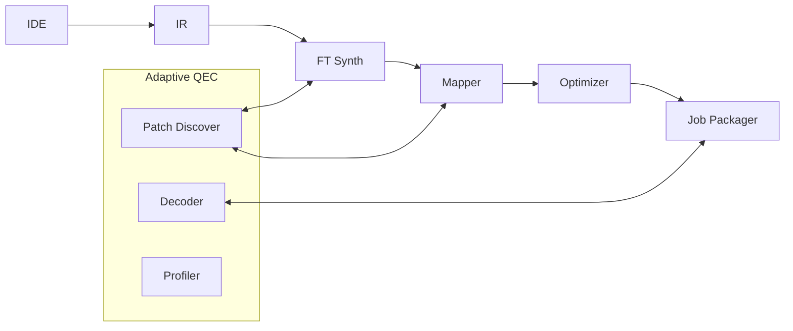
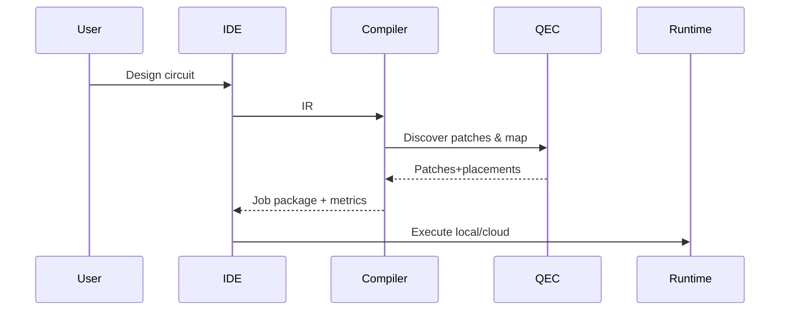

<!-- SPDX-License-Identifier: PolyForm-Noncommercial-1.0.0 | SPDX-FileCopyrightText: 2025 Dr. Debasis Mondal <deba10106@gmail.com> -->

# QCraft — Technical Specification Document (TSD)
Privacy-Preserving, Adaptive Quantum Circuit Execution and Error Correction Platform

Version: 0.9-concept
Date: 2025-09-20
Status: Product architecture blueprint (concise)

## Table of Contents
- [1. Executive Summary](#1-executive-summary)
- [2. Objectives](#2-objectives)
- [3. Target Users](#3-target-users)
- [4. Core Features](#4-core-features)
- [5. Privacy Mechanisms](#5-privacy-mechanisms)
- [6. Functional Requirements (subset)](#6-functional-requirements-subset)
- [7. KPIs](#7-kpis)
- [8. System Overview](#8-system-overview)
- [9. Technical Specifications (concise)](#9-technical-specifications-concise)
- [10. APIs (v0 sketch)](#10-apis-v0-sketch)
- [11. Workflow (sequence)](#11-workflow-sequence)
- [12. Risks & Mitigations](#12-risks--mitigations)
- [13. Roadmap & Business](#13-roadmap--business)
- [14. Competitive Advantage](#14-competitive-advantage)
- [15. Future Extensions](#15-future-extensions)
- [16. Non-Functional Requirements](#16-non-functional-requirements)
- [17. Hardware & Software Requirements](#17-hardware--software-requirements)
- [18. Detailed Technical Specifications (module overview)](#18-detailed-technical-specifications-module-overview)
- [19. Data Models & Formats (concise)](#19-data-models--formats-concise)
- [20. APIs (v0)](#20-apis-v0)
- [21. Recommended Workflow (A) and Critique (B)](#21-recommended-workflow-a-and-critique-b)
- [22. Engineering Solutions (C) and Explicit Problems (D)](#22-engineering-solutions-c-and-explicit-problems-d)
- [23. Testing & Validation](#23-testing--validation)
- [24. Deployment & Maintenance](#24-deployment--maintenance)
- [25. Security & Compliance](#25-security--compliance)

## 1. Executive Summary
QCraft is a desktop-first IDE + compiler OS layer that compiles user logical circuits into privacy-preserving, fault-tolerant (FT) jobs tailored to diverse quantum hardware. RL + GNN models discover code patches, map them on device qubit graphs, decode syndromes, and optimize circuits using feedback from runs. Providers see obfuscated FT jobs; original logic remains local.

## 2. Objectives
- Privacy-first: keep logical circuits local; export only encoded jobs.
- Fault-tolerance: device-aware FT transform & mapping.
- Device agnostic: superconducting, ion-trap, photonic, spin-qubit.
- Adaptive QEC: RL+GNN profiler/decoder improves with usage.
- Modular biz: separate IDE, compiler stack, adaptive QEC library.

## 3. Target Users
Academia; Pharma; Finance; Government/Defense; Hardware vendors.

## 4. Core Features
- Circuit IDE & visualizer (FT overlays, multi-backend selector).
- Code patch discoverer (RL+GNN); qubit grid mapper (RL+GNN).
- RL-enhanced optimizer; adaptive syndrome decoder; RL error profiler.
- Code switcher / magic-state distillation (resource-aware).

## 5. Privacy Mechanisms
Offline FT compile + mapping; local/conditional decoding; partial obfuscation now; BQC roadmap.

## 6. Functional Requirements (subset)
| ID | Requirement | Priority |
|---|---|---|
| FR-01 | Desktop IDE editor/visualizer | High |
| FR-02 | Import/Export (Qiskit/Cirq/Braket) | High |
| FR-03 | FT transform engine | High |
| FR-04 | RL+GNN code patch discoverer | High |
| FR-05 | RL+GNN qubit grid mapper | High |
| FR-07 | RL+GNN decoder | High |
| FR-10 | IBM/IonQ/Rigetti adapters | High |
| FR-11 | Offline-first execution | High |

## 7. KPIs
≥20% fidelity uplift; ≥30% qubit-overhead reduction; ≥25% latency reduction via local decoding; 1000+ users/18mo; 5–10 pilots/Y2.

## 8. System Overview

Local: FT+map+decode. Cloud: optional execution only.

## 9. Technical Specifications (concise)
- Data formats (JSON): IR{qubits,clbits,gates[{name,qubits,params?}]}; Device{native_gates,connectivity,props,capabilities}; ErrorProfile{params+uncertainty}; Patch{family,distance,layout,supported_logical}; Mapping{placements,swaps,latency}; JobPackage{native_job,decoder_hooks,provenance}.
- Dual-path cost model: A) decompose→encode→map; B) encode→synthesize→decompose→map; choose min expected error under qubit/time constraints.
- RL+GNN: device graph + patch graph embeddings; rewards for validity, fidelity proxy, SWAP/crosstalk, ancilla/time, decoder latency.
- Local decoder runtime: low-latency handlers; conditional logic; audit logs.
- Provider adapters: feature detection (mid-circuit, conditional, dynamic); back-pressure to compiler when unsupported.

## 10. APIs (v0 sketch)
- POST /compile {ir, device_profile?, goals?, strategy?} → {job_package, metrics, provenance}
- POST /discover_patches {ir, device_profile, error_profile} → {patches, mapping_hints}
- POST /decode {syndromes, policy} → {corrections, confidence}
- POST /execute_local {job_package, shots?} → {job_id}; GET /job/:id → {status,result?}

## 11. Workflow (sequence)


## 12. Risks & Mitigations
Competition→privacy/offline USP; Long training→hybrid sim+traces; API limits→capability detect + local control; Noise opacity→uncertainty-aware profiler; Privacy limits→BQC roadmap.

## 13. Roadmap & Business
0–6m: Editor/Optimizer proto; 6–12m: Discoverer/Mapper RL + Profiler; 12–18m: Decoder, Code Switcher, MSD; 18–24m: pilots/partnerships.
Revenue: IDE tiers, compiler stack license, adaptive QEC library, memory spin-off.

## 14. Competitive Advantage
Vendor-agnostic, privacy-first, adaptive (RL+GNN), spin-off potential.

## 15. Future Extensions
Attested execution; FPGA decoder; advanced LDPC; GNN-based pulse-level co-design; differential privacy for telemetry.

## 16. Non-Functional Requirements

- Performance: IDE load <3s; 10k-gate project open <2s; local decode p50 <1ms, p95 <5ms; compile (50k gates) <5m CPU, <2m GPU.
- Privacy/Security: logical IR never leaves host by default; export redaction; secrets in OS keyring; signed provenance; audit logs.
- Scalability: multi-GPU RL/GNN; resumable checkpoints; artifact pruning.
- Compatibility: IBM/IonQ/Rigetti first; dynamic feature detection (mid-circuit, dynamic circuits, conditionals); Qiskit/Cirq/Braket IO.
- Reliability: checkpoint ≤10m; safe fallbacks for decoder/optimizer.
- Observability: JSONL logs, metrics, provenance.

## 17. Hardware & Software Requirements

| Category | Minimum | Recommended |
|---|---|---|
| OS | Linux 20.04+/Win11/macOS13+ | Linux 22.04 LTS |
| CPU | 4 cores | 8–16 cores |
| RAM | 8 GB | 32 GB |
| GPU | optional | NVIDIA RTX 8–24 GB |
| Disk | 5 GB | 50 GB (artifacts) |
| Python | 3.9+ | 3.11 |

Key deps: PySide/Qt, NumPy, PyTorch, NetworkX, Matplotlib, Gymnasium, Stable-Baselines3; optional Qiskit/Cirq/Braket.

## 18. Detailed Technical Specifications (module overview)

- Compiler OS Layer
  - QCraft IR (logical-first), Dual-Path Cost Model (A/B), FT Synthesizer, RL-enhanced Optimizer, Exporters/Adapters.
- Adaptive QEC
  - Patch Discoverer (RL+GNN), Qubit Grid Mapper (RL+GNN), Adaptive Decoder (RL+GNN with classical fallback), Error Profiler (bandit/RL), Magic-State/Code-Switch policy.
- Runtime & Privacy
  - Local Decoder Runtime (CPU baseline, GPU/FPGA optional), Conditional Logic Engine, Job Packager with capability detection and redaction.
- Data & Governance
  - Logging/Results, Artifacts (models/patches), Signed Provenance.

Algorithms: PPO/A2C for RL; GNN encoders on device/patch graphs; uncertainty-aware profiling; analytic+ML cost models.

## 19. Data Models & Formats (concise)

- IR: {qubits, clbits, gates[{name, qubits, params?}], metadata}
- Device: {provider, device_name, native_gates[], connectivity, qubit_properties, capabilities}
- ErrorProfile: {params with mean/CI, correlated, non_markovian}
- QEC Patch: {family, distance, layout_type, supported_logical[], resources}
- Mapping: {patches[{id, qubits[], placement{logical→physical}}], swaps, crosstalk_score, latency_ns}
- JobPackage: {provider, device, native_job, decoder{strategy,hooks[]}, provenance{ft_family,distance,policy}}

## 20. APIs (v0)
- POST /compile → {job_package, metrics, provenance}
- POST /estimate → {pathA:{fidelity,cost}, pathB:{fidelity,cost}, recommendation}
- POST /discover_patches → {patches, mapping_hints}
- POST /decode → {corrections, confidence}
- POST /execute_local → {job_id}; GET /job/:id → {status, result?}
OpenAPI v3.1 reference: `docs/api/openapi.yaml`

Example (compile):
```bash
curl -X POST http://localhost:8080/compile \
  -H 'Content-Type: application/json' \
  -d '{
    "ir": {
      "version": "1.0",
      "qubits": 4,
      "clbits": 2,
      "gates": [ {"name":"H","qubits":[0]}, {"name":"CX","qubits":[0,1]} ]
    },
    "goals": { "fidelity_min": 0.9 },
    "strategy": "auto"
  }'
```

## 21. Recommended Workflow (A) and Critique (B)

- A) Best-practice pipeline
  1) Design → 2) Analyze (T-count, locality) → 3) Profile device (capabilities+noise) → 4) Decide strategy (decompose-first vs encode-first) → 5) QEC selection (patches, switching) → 6) Encoded synthesis → 7) Mapping → 8) Resource scheduling → 9) Local decode planning → 10) Validate/simulate → 11) Package/execute → 12) Learn.
- B) Pitfalls & caveats
  - Ordering matters (decompose timing); encoding/mapping must be co-optimized; transversality vs native costs; MSD is expensive; code-switch overheads; decoder latency; vendor opacity; resource estimate errors; classical control gaps; privacy is partial without BQC.

## 22. Engineering Solutions (C) and Explicit Problems (D)

- Solutions (C)
  - Dual-path cost model; Joint RL+GNN co-optimizer; Magic-state vs Code-switch decision policy; Local decoder runtime + conditional logic; Uncertainty-aware profiler + simulator-in-the-loop; Capability detection + adaptive cadence; Provenance/attestation; Magic-state factory scheduler; Graceful degradation.
- Problems (D)
  - Gate-set mismatch → cost-model dual path.
  - Separate code selection/mapping → joint co-optimization.
  - Non-transversal gates costly → RL policy over MSD/code-switch/approx.
  - Cloud decoding latency → local decoder + conditional logic.
  - Vendor noise opacity → uncertainty-aware profiling.
  - API control limits → detect/adapt or local control.
  - Resource estimate risk → simulator-in-loop pruning.
  - Partial privacy → obfuscation now; BQC roadmap.

## 23. Testing & Validation

- Unit: IR ops, encoders, cost model numerics, adapters.
- Integration: end-to-end compile on mocked devices; decode latency tests.
- Performance: compile time, SWAP count, latency, throughput.
- Benchmarks/KPIs: fidelity uplift, overhead reduction, latency reduction; regression dashboards.

## 24. Deployment & Maintenance

- Local install (venv) with optional extras for providers; model artifacts under ~/.qcraft.
- Updates: semantic versioning; model/artifact migration scripts; rollback support.
- Telemetry: opt-in only; privacy-preserving aggregates.

## 25. Security & Compliance

- Secrets in keyring; encrypted at rest; no plaintext API keys.
- Export policy engine (redaction levels: none/obfuscate/strict-local).
- Signed provenance manifests; audit log retention policies.
- Compliance roadmap: SOC2-style controls for enterprise editions; BQC integration when feasible.
